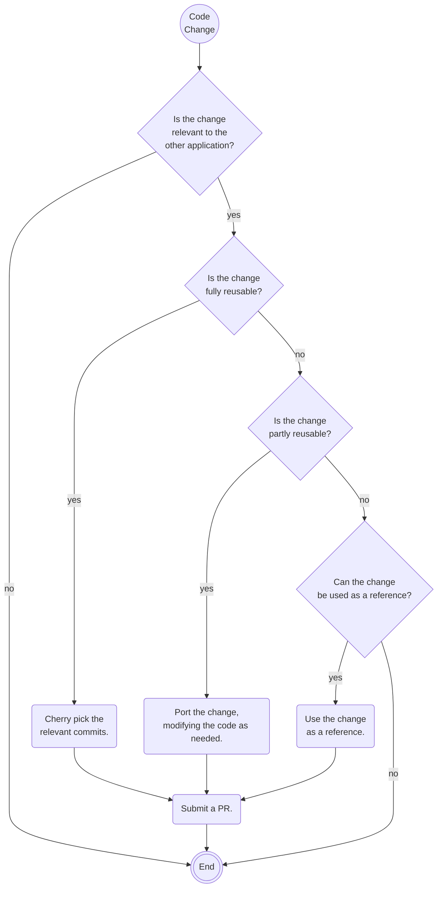

# Sharing Code Changes Between JASPER and the Court Viewer

## Forward

Although JASPER started as a fork of the Court Viewer ([SCV](https://github.com/bcgov/supreme-court-viewer)), the code base for JASPER has diverged significantly from it's origins in the Court Viewer.  The most significant changes have been to the UI where not only has there been a migration to Vue3, but there have also been significant changes to the UI and UX with the addition of the Judicial/Court calendar, as well as the addition of full on court file search, and changes to the court-list screen.  From a UI/UX and use case perspective the two applications no longer resemble one another.  On the backend, code has been added to support the new user experiences, though much of the existing code supporting file access remains relatively unchanged.  As JASPER continues to be developed it is expected the backend code will continue to change with the most significant changes to the existing code being related to access controls.  In summary, overall, JASPER is and will continue to become even more so a completely separate application apart from the Court Viewer.

That said, since they began as siblings, there are things they can continue to share.  There are a set of decisions that need to be made in order to determine whether to share a change between the code bases and how to share the change.  The trigger in the decision process is always a change to one or the other code bases.

There are three categories to the changes:

## Unrelated changes

Changes made to one application that are not relevant to the other.

Examples of this type of change are the addition of the Judicial/Court calendar and file search features in JAPSER.  These features are irrelevant to the Court Viewer, as the Court Viewer is integrated into applications that already implement these functions for the users.

## Partially reusable changes

Changes to one or the other application that can be reused in the other with some modification or adjustments to the implementation, or that can just be used as a reference.

Examples include:

### Example - Dev Container implementation

A Dev Container was created for JASPER to ensure the developers had a consistent and repeatable local development environment containing all of the tools and frameworks they needed to develop and manage the application.

The [Dev Container from JAPSER](https://github.com/bcgov/jasper/tree/master/.devcontainer) was used as the basis for the [Dev Container for the Court Viewer](https://github.com/bcgov/supreme-court-viewer/pull/289).  The Court Viewer only requires a subset of tools and frameworks used by JASPER, so the implementation was adjusted to suit the Court Viewer.

### Example - Vue 3 Upgrade

JASPER was upgraded to Vue 3 following some additions and modification of UI components.

While the Court Viewer may not be able to use much of the code directly, the process used to upgrade to Vue 3 can be reused for the Court Viewer.

## Fully reusable changes

Changes to either application that can be directly reused in the other.

Examples include:

### Example - [Fix for SSO Login Issue](https://github.com/bcgov/supreme-court-viewer/pull/288)

The fix was developed in JASPER and it was possible to cherry pick the same commit to fix the same issue in the Court Viewer.

## Making the descision whether to share code and how

Given the discussion to this point the most appropriate way to make this descision is to follow a decision tree.

